# Automated Time Table Management System

A full-stack timetable automation platform for managing schedules, academic resources, and temporary lecture operations across administrators, teachers, and students.

Built with **HTML, CSS, JavaScript, Bootstrap, Node.js, Express.js, and MySQL**, this application streamlines timetable planning, reduces scheduling conflicts, and provides clear weekly timetable visibility with printable views.

---

## Overview

The **Automated Time Table Management System** is a scheduling optimization system designed for institutions that need a practical and structured way to create, manage, validate, and publish weekly timetables.

The system supports:

- centralized management of teachers, students, subjects, departments, classes, sections, and rooms
- automatic timetable generation with conflict prevention
- customizable lecture duration, lab duration, and slot timings
- theory and lab handling within a single subject record
- teacher-wise, student-wise, and section-wise timetable visibility
- temporary extra lecture request and approval workflows
- printable timetable outputs for operational use

This project is designed to feel like a real timetable management solution rather than a demo-only application. It focuses on realistic scheduling rules, clear role-based access, and practical admin visibility tools.

---

## Problem Statement

Timetable creation is often handled manually or with limited spreadsheet-based workflows. This creates common problems such as:

- teacher clashes across sections
- classroom and lab double-booking
- incomplete lecture allocation
- poor visibility into free teachers and free rooms
- difficulty in scheduling lab sessions that require consecutive slots
- limited support for temporary lectures, makeup classes, or administrative adjustments

As scheduling complexity increases, manual processes become slower, less reliable, and harder to maintain.

This system solves that by combining timetable automation, validation, room allocation, role-based visibility, and temporary lecture management into a single web application.

---

## Key Features

### Timetable Automation

- automatic timetable generation
- teacher conflict prevention
- room conflict prevention
- section conflict prevention
- support for theory-only, lab-only, and theory + lab subjects
- lab allocation in consecutive slots
- room capacity validation
- teacher availability validation
- balanced scheduling with reduced teacher back-to-back overload where possible
- manual timetable override support

### Smart Validation and Failure Detection

- validates slot timing compatibility before generation
- checks lecture duration and lab duration feasibility
- detects insufficient classroom or lab capacity
- detects teacher overload and limited availability
- blocks incorrect or incomplete timetable generation
- returns failure reasons with practical solution suggestions

### Admin Visibility Tools

- teacher-wise printable timetable
- section-wise timetable grid
- teacher free slot visibility
- room free slot visibility
- scheduling support view for free teachers, classrooms, and labs
- teacher workload report
- room allocation report

### Temporary Lecture Management

- teacher extra lecture and lab request system
- admin approval, rejection, room reassignment, and cancellation support
- conflict notification when requested slots become unavailable
- temporary lecture clash prevention
- automatic cleanup of completed temporary lectures

### Data Management

- CRUD support for teachers, students, subjects, classrooms, classes, sections, and departments
- profile management for admin, teacher, and student users
- secure password change support
- admin password reset for managed users
- Excel and CSV upload for bulk entry
- balanced dummy data support for testing

---

## Roles and Capabilities

### Admin

- log in securely
- manage teachers, students, subjects, departments, classes, sections, and rooms
- configure timetable settings and slot timings
- manage teacher availability
- generate, clear, and manually edit timetables
- review teacher-wise and section-wise timetable views
- check teacher free slots and room free slots
- approve or reject temporary lecture requests
- access reports and printable views
- manage user profiles and reset teacher/student passwords

### Teacher

- log in securely
- view assigned subjects
- view weekly timetable grid
- view free periods and availability
- request extra lectures or labs
- check room availability before submitting requests
- cancel eligible temporary lecture requests
- manage profile and password

### Student

- log in securely
- view weekly timetable grid
- view subject schedule
- view assigned faculty information
- manage profile and password

---

## System Modules

### Authentication Module

Handles session-based authentication and role-based route access for admin, teacher, and student users.

### Admin Management Module

Provides full control over system records, timetable settings, timetable generation, report access, and temporary lecture approvals.

### Teacher Management Module

Stores teacher records, workload settings, subject assignments, and availability information. Also supports teacher-side schedule visibility and temporary request workflows.

### Student Management Module

Maintains student records and provides timetable visibility based on class and section mapping.

### Subject Management Module

Supports combined theory and lab handling in a single subject entry with:

- subject code
- subject name
- subject type
- theory lectures per week
- lab sessions per week
- credits

### Classroom and Lab Module

Stores room information such as room name, type, and capacity. Used by the timetable engine for room allocation and clash prevention.

### Timetable Engine Module

The core scheduling module that generates the timetable using configured rules, validations, and optimization priorities.

### Temporary Lecture Module

Handles extra lecture requests, approval workflow, room assignment, conflict detection, cancellation, notification, and automatic status cleanup.

### Reporting and Printing Module

Supports printable timetable layouts and administrative reporting for workload and room usage.

### Profile Management Module

Allows admin, teacher, and student users to view and update profile information and change passwords securely.

---

## Tech Stack

### Frontend

- HTML5
- CSS3
- JavaScript
- Bootstrap 5

### Backend

- Node.js
- Express.js

### Database

- MySQL

### Supporting Packages

- `mysql2`
- `express-session`
- `bcryptjs`
- `multer`
- `xlsx`
- `nodemon`

---

## Database Design

The application uses a relational MySQL design with normalized academic and scheduling entities.

### Main Tables

- `admins`
- `users`
- `teachers`
- `students`
- `departments`
- `classes`
- `sections`
- `subjects`
- `class_subjects`
- `teacher_subjects`
- `teacher_availability`
- `classrooms`
- `timetable`
- `reports`
- `timetable_settings`
- `slot_timings`
- `extra_lecture_requests`

### Database Highlights

- foreign key relationships for consistency
- separate user and role-linked entity tables
- timetable settings stored independently from timetable entries
- dedicated temporary lecture request table
- support for theory + lab subject structure
- slot-based teacher availability matrix

---

## Timetable Generation Logic

The timetable generator is designed to produce realistic schedules while preventing invalid allocations.

### Core Logic

1. Load sections, subjects, teacher mappings, availability, room data, slot timings, and timetable settings.
2. Validate whether the current timetable configuration is feasible.
3. Build scheduling tasks for theory sessions and lab sessions.
4. Prioritize more constrained tasks, especially labs requiring consecutive slots.
5. Try valid combinations of day, slot, teacher, room, and section.
6. Reject invalid combinations immediately.
7. Save only fully valid timetable entries.

### Conflict Prevention

- teacher cannot be assigned to multiple classes in the same slot
- room cannot be allocated more than once in the same slot
- section cannot be assigned more than one subject in the same slot
- duplicate timetable entries are prevented through logic and database constraints

### Allocation Rules

- teacher availability must match the requested slot
- theory lectures must fit lecture-duration-compatible slots
- lab sessions must fit lab-duration-compatible consecutive slots
- labs prefer lab rooms
- room capacity must satisfy section strength
- scheduling tries to avoid unnecessary consecutive classes for the same teacher where possible

### Smart Failure Handling

If generation is not realistically possible, the system stops instead of producing a partial or incorrect timetable.

Examples of failure scenarios:

- not enough classrooms
- not enough lab rooms
- teacher availability too limited
- theory or lab demand exceeds available capacity
- configured lecture/lab duration does not match slot timings
- no consecutive slot blocks available for lab sessions

When failure occurs, the system returns:

- a clear failure reason
- relevant debug details
- practical suggestions to resolve the issue

---

## Temporary Extra Lecture Management

The application includes a temporary lecture request workflow for operational scheduling changes.

### How It Works

1. Teacher checks available free slots and free rooms.
2. Teacher submits an extra lecture or lab request for a specific date and slot range.
3. Admin reviews pending requests.
4. Admin approves, rejects, cancels, or updates room allocation.
5. The system validates:
   - teacher availability
   - teacher slot clash
   - room clash
   - section clash
   - request type compatibility
6. If another request gets approved first, conflicting pending requests are marked for reschedule and teachers are notified.
7. After the scheduled time passes, temporary lectures are automatically moved out of active scheduling through status cleanup.

### Extra Lecture Features

- teacher request form
- admin approval workflow
- conflict notification system
- room free slot assistance
- teacher free slot assistance
- temporary lecture cancellation
- automatic temporary lecture cleanup

---

## Excel Upload Support

Bulk upload is available alongside manual forms for faster data entry.

### Supported Upload Modules

- teachers
- students
- subjects
- classrooms

### File Support

- `.xlsx`
- `.csv`

### Upload Features

- simple template download
- duplicate-aware processing
- success and failure feedback messages
- beginner-friendly implementation using `multer` and `xlsx`

---

## Reports and Printable Timetable

The system includes operational reporting and print-friendly timetable layouts.

### Available Outputs

- section-wise timetable
- teacher-wise timetable
- teacher self timetable
- student timetable
- teacher workload report
- room allocation report
- summary reporting

### Print Behavior

- prints only the selected timetable grid
- hides sidebars, buttons, filters, and extra controls
- includes clean timetable metadata for the selected view
- optimized with `@media print`

---

## Installation

### 1. Clone the Repository

```bash
git clone <your-repository-url>
cd automated-time-table-management-system
```

### 2. Install Dependencies

```bash
npm install
```

### 3. Configure MySQL

Create the database:

```sql
CREATE DATABASE automated_timetable_db;
```

### 4. Import Schema

```sql
USE automated_timetable_db;
SOURCE database/schema.sql;
```

You can also import [schema.sql](D:\Automated Time Table Generator\database\schema.sql) through MySQL Workbench or phpMyAdmin.

### 5. Verify Database Connection

Default database settings from [db.js](D:\Automated Time Table Generator\config\db.js):

```text
host: localhost
user: root
password: root123
database: automated_timetable_db
```

You can update these values directly or provide:

- `DB_HOST`
- `DB_USER`
- `DB_PASSWORD`
- `DB_NAME`

### 6. Optional Test Data Setup

To load balanced sample data and generate a usable timetable:

```bash
npm run seed:test-data
```

---

## Running the Project

### Start the Application

```bash
npm start
```

### Development Mode

```bash
npm run dev
```

### Open in Browser

```text
http://localhost:3000
```

---

## Default Login Credentials

Sample seeded accounts use:

```text
Password: admin123
```

### Admin

- Username: `admin`
- Role: `admin`

### Teacher

- Username: `teacher1`
- Role: `teacher`

### Student

- Username: `student1`
- Role: `student`

---

## Project Structure

```text
project-root/
|
|-- server.js
|-- package.json
|-- package-lock.json
|
|-- config/
|   |-- db.js
|
|-- routes/
|   |-- adminRoutes.js
|   |-- teacherRoutes.js
|   |-- studentRoutes.js
|   |-- subjectRoutes.js
|   |-- classroomRoutes.js
|   |-- timetableRoutes.js
|
|-- controllers/
|   |-- adminController.js
|   |-- teacherController.js
|   |-- studentController.js
|   |-- subjectController.js
|   |-- classroomController.js
|   |-- timetableController.js
|
|-- models/
|   |-- adminModel.js
|   |-- teacherModel.js
|   |-- studentModel.js
|   |-- subjectModel.js
|   |-- classroomModel.js
|   |-- timetableModel.js
|
|-- middleware/
|   |-- authMiddleware.js
|   |-- uploadMiddleware.js
|   |-- excelHelper.js
|
|-- views/
|   |-- login.html
|   |-- dashboard.html
|   |-- teachers.html
|   |-- students.html
|   |-- subjects.html
|   |-- classrooms.html
|   |-- timetable.html
|   |-- reports.html
|   |-- profile.html
|
|-- public/
|   |-- css/
|   |   |-- style.css
|   |-- js/
|   |   |-- app.js
|   |-- images/
|
|-- database/
|   |-- schema.sql
|   |-- seedTestData.js
|
|-- README.md
```

---

## Screenshots

Add screenshots here for portfolio or documentation use.

### Login Page

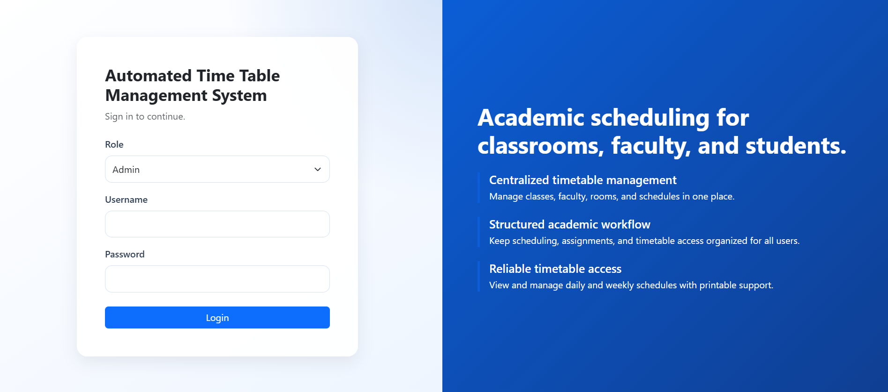

### Admin Dashboard

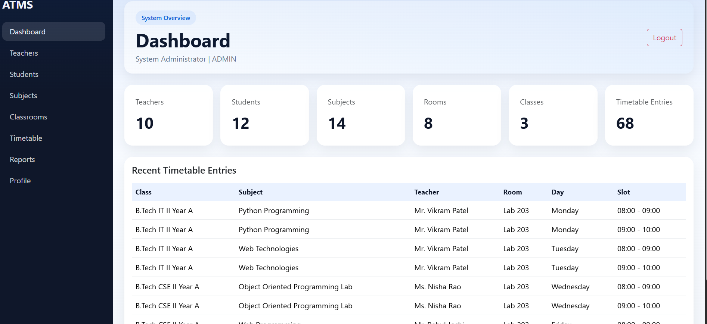

### Teacher Management

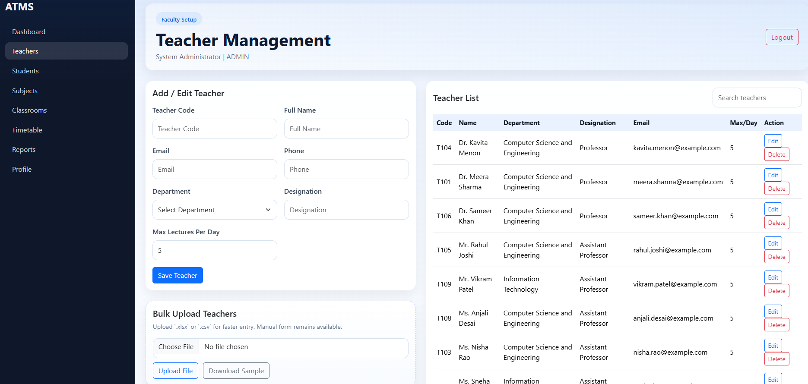

### Student Management

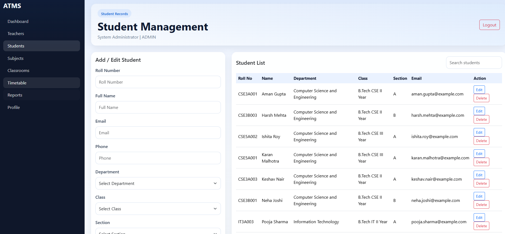

### Subject Management

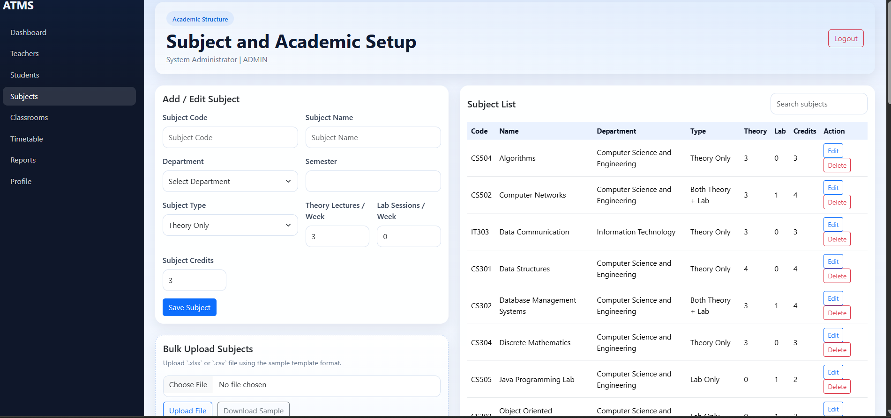

### Classroom and Lab Management

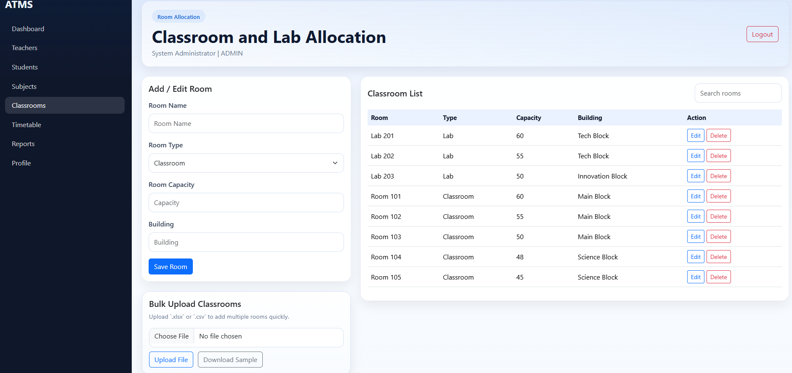

### Student Timetable Grid

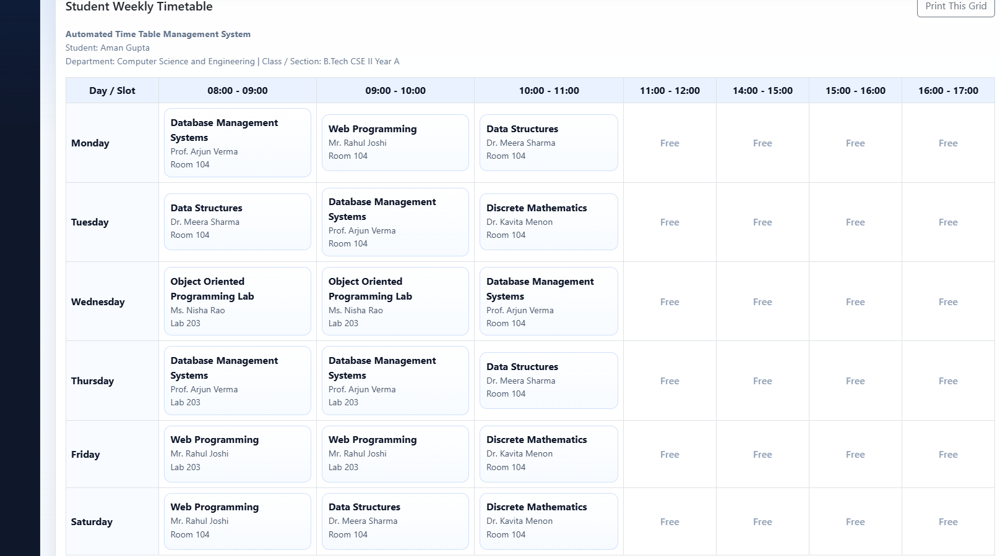

### Teacher Timetable Grid

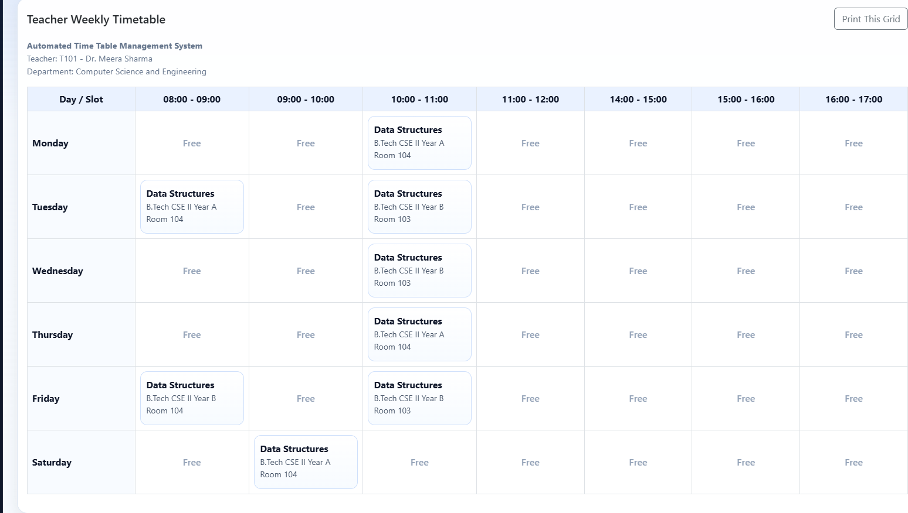

### Teacher Free Slot Visibility

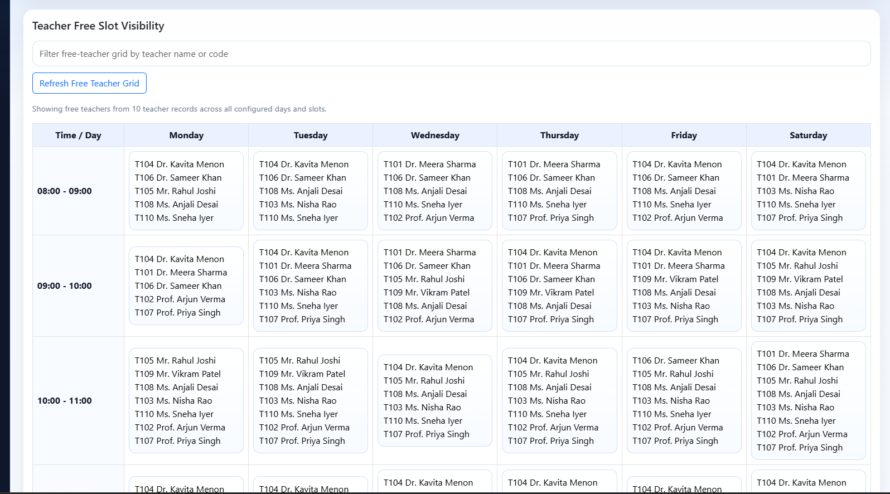

### Room Free Slot Visibility

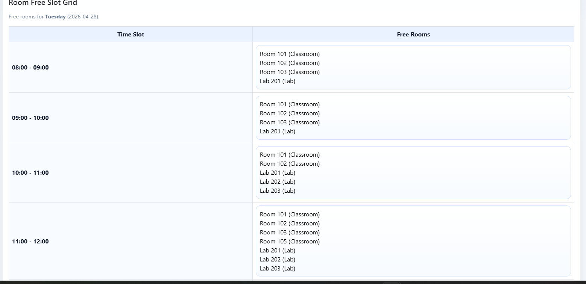

### Temporary Lecture Request Workflow

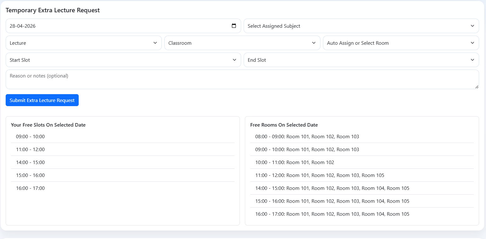

---

## Future Improvements

- PDF and Excel export for all timetable views
- notification delivery through email or SMS
- institution-wide holiday calendar integration
- substitution management for absent teachers
- semester and academic-year based filtering
- advanced optimization strategies for very large datasets
- audit log for administrative actions
- multi-campus resource planning

---

## Conclusion

The **Automated Time Table Management System** brings timetable automation, operational visibility, and temporary lecture management into one structured web application.

It combines:

- automated scheduling
- resource allocation
- conflict detection
- role-based access
- printable timetable presentation
- profile and user management

The result is a practical scheduling platform that can support day-to-day timetable operations while remaining easy to maintain, easy to extend, and strong enough to showcase in a professional portfolio.